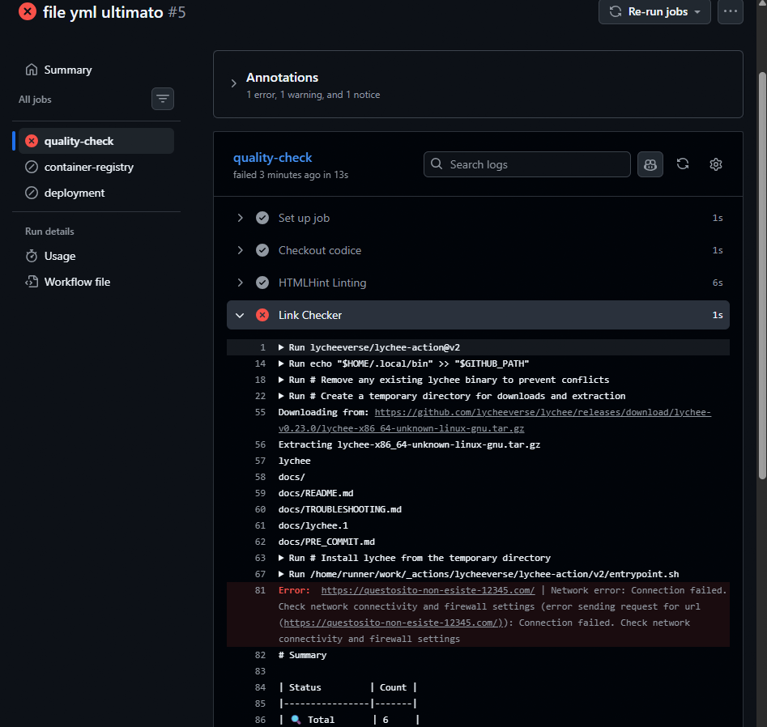
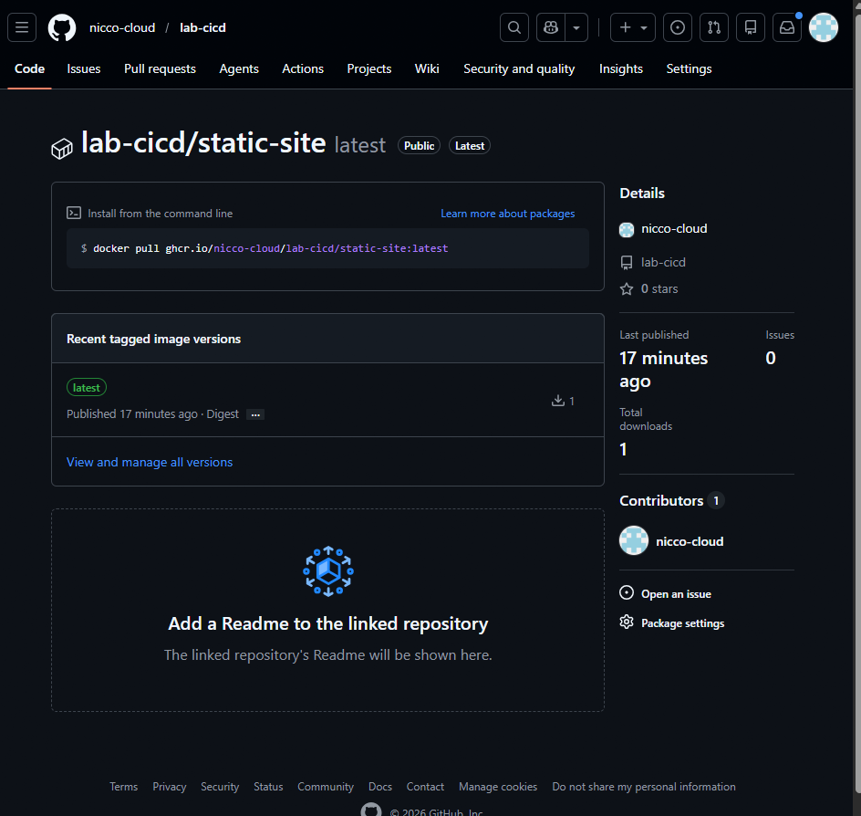

# Relazione di Laboratorio: Pipeline CI/CD per Web Application Statica

## 1. Link repo - Link GitHub Pages

- **Studente:** Niccolò
- **Repository GitHub:** https://github.com/nicco-cloud/Lab-CICD
- **Sito Live (GitHub Pages):** https://nicco-cloud.github.io/Lab-CICD/

## 2. Azioni CI/CD

## 3. Packages CI/CD

